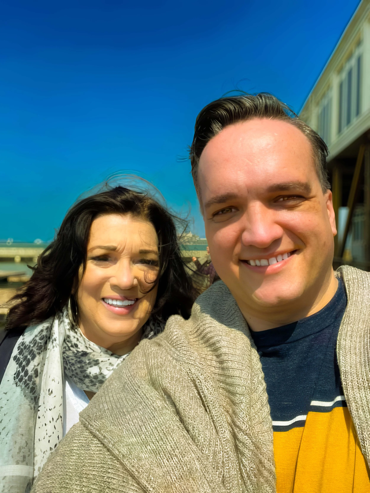

## Director's statement

I thought I was choosing the easy assignment. For a nine-minute student documentary in San Francisco, I pointed a Samsung S20 at my mother, Robyn Stewart, and asked about the American Airlines career she began in 1971. The story did not stay small.

I expected a small family portrait. Robyn's memories led me to my grandfather, Jay R. Ricks, and his work on American Airlines' Boeing 747 training program. Old photographs and conversations kept widening the story.

Then the camera turned toward me. As a gay filmmaker in my forties, I began asking where I fit inside this inheritance and what I might leave behind. The film forced me to see my family without the neatness I had planned. The mess was where the story lived.

I shot the entire film on my phone because it was the camera I had and could afford. I edited it on a MacBook Pro that wheezed at every render. Those limits kept the filmmaking intimate. There was no crew between my mother and me, and no polished distance to hide behind when the material became personal.

The festival response still surprises me. This film has always been for an audience of one: to make my mom feel special. By honoring my mother, I found a way to tell my own story too.

What began as a classroom assignment became Golden Wings.

## Background

I started acting at 13 and moved into writing and producing. In 2014 I made a comedy web series called "Tequila Mockingbird." I'm a proud member of Actors' Equity.

The student documentary came out of Janice Engel's class at the Academy of Art University, and I finished the nine-minute cut in March 2023. When I showed it to an acquaintance who had never met my mother, they cried, and I kept going. The longer cut added my mother's alcohol dependency, which the student version left out. It premiered at the Silicon Beach Film Festival at the TCL Chinese Theatre and won Best Short Cinematography. In July 2025 it won Best Short Documentary at the Swedish International Film Festival.

## The real judges

After a NewsFest screening, a woman of my mother's generation, a complete stranger, came up to me and told me what the film meant to her as a mother. NewsFest gave the film three awards. People like her are the real judges.

## Mallorca

I studied at the University of the Balearic Islands and spent three years in Mallorca learning Spanish. Spanish festivals kept turning the film down. In November 2025 the Palma Film Festival selected it. Mallorca is my second home, so that festival was a homecoming.

## How I work

I don't fake moments. My subjects are collaborators, and my mother is the first of them. Where period footage was missing, I used synthetic media reconstruction.

Press and festival inquiries: [caleb@golden-wings-robyn.com](mailto:caleb@golden-wings-robyn.com). Production: Gwingz Studios.
