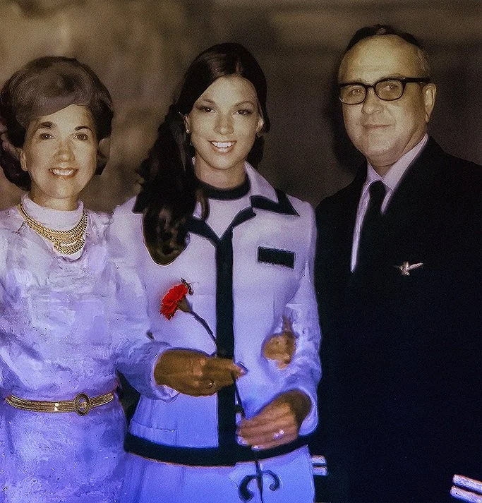

Robyn Stewart started American Airlines Stewardess College on June 24, 1971. She figured she would fly for two to five years. As of 2026, she has flown for 55.

She took the job for the travel. Her father, Jay R. Ricks, was an American Airlines flight engineer, and Robyn grew up taking family trips on his flight benefits. "I wanted to become a flight attendant because I wanted to fly free," she says in the film.

## Girdle checks and weigh-ins

The airline she joined inspected its stewardesses. American checked their girdles, makeup, hair, and nails, and held them to a weight limit. The girdle checks ended not long after Robyn graduated. The weigh-ins lasted much longer: after each of her pregnancies, the last in 1982, American put her back on a scale to make weight. She puts the end of weight checks close to 1990.

The stewardess manual she got at graduation didn't last either. American had merged with Trans Caribbean Airways, which employed male flight attendants, so the manual needed a new name.

## The 747

Robyn trained on the 747 in Dallas, on the airplane her father had worked on, and flew it out of JFK to San Juan. "A great experience," she says, "and to go back and train out on the airplane that my father had been so involved with."

Her seniority lets her pick her trips now, Rome and Tokyo among them.

## After 9/11

Robyn tells the film about September 11 from a crew member's side. In 2013 American removed her from service. She went through rehab for alcohol dependency and came back to flying. In 2014 her husband, Henry Stewart, died while she was on a Frankfurt layover.

Her son Caleb made Golden Wings for an audience of one. "She's the reason I made this thing," he says.
